# Introduction

## About the Data

The Data contains all the flights that travel nonstop between overseas locations and airports in the United States.

Source :- <https://data.transportation.gov/Aviation/International_Report_Departures/innc-gbgc>

# Exploratory Data Analysis

* The dataset contains monthly data so within each year we have 12 observations, one for each month.

* There are 1053 US airports in total.
  
* The US airports having most departures vs. the foreign airports having most arrivals:
  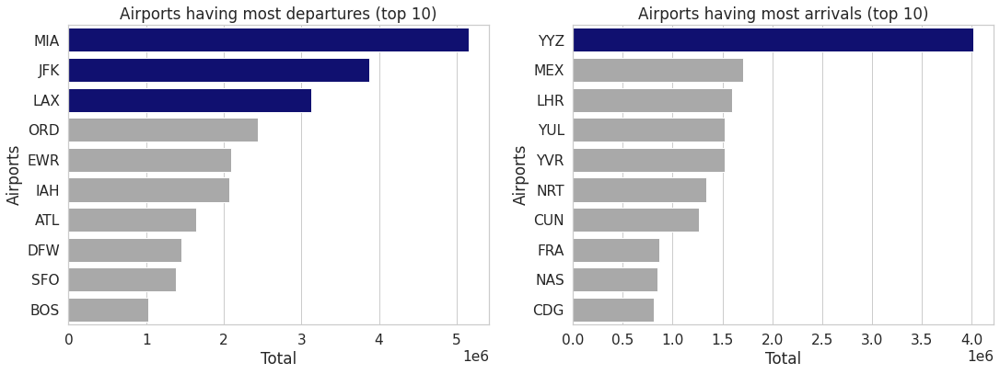

* Total departures per month over time :
  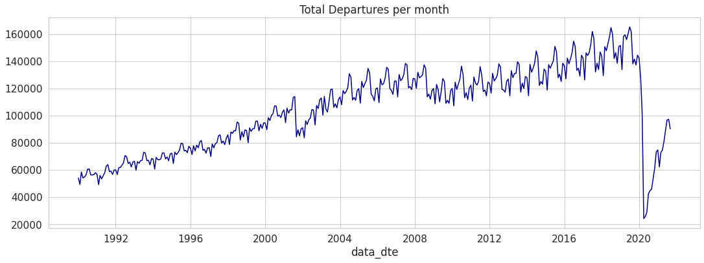

* Scheduled vs. Charter departures per month over time :
  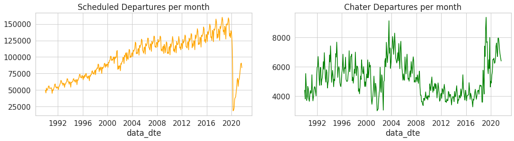
  There is a lot of irregularity in the green line graph i.e. the charter departures.
  
* All departures per month over time (zoomed in) :
  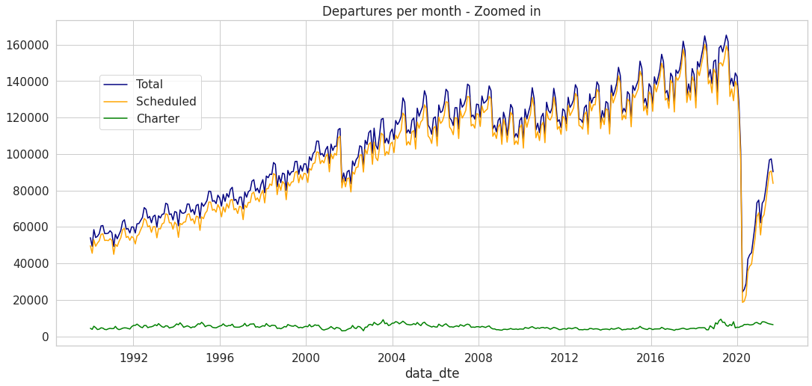

* Departures in the Pre Pandemic phase :
  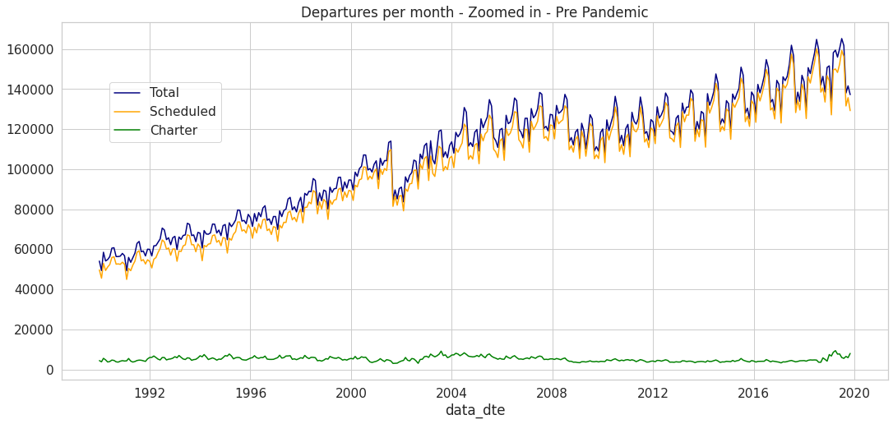
  At the end of the pre pandemic phase, there is a sudden increase in the Charter Departures

* Departures in the Post Pandemic phase :
  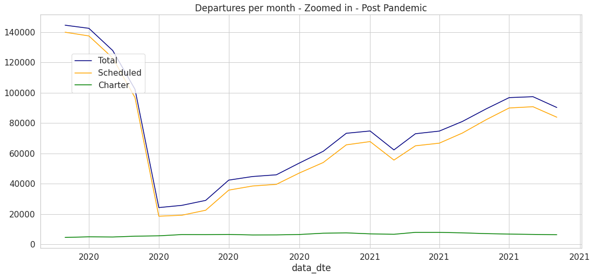
  The number of scheduled departures dropped suddenly when the pandemic hit, but the same is not true charter departures.
  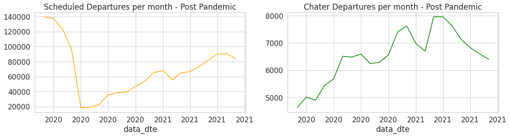

# Analyzing and Transforming the Data for Forcasting

## Transforming the data for univariate forecasting

  In order to perform the univariate forcasting, the model needs only a single feature, the one which will be forecasted, i.e., the `Total` column with date-time as the index.  
  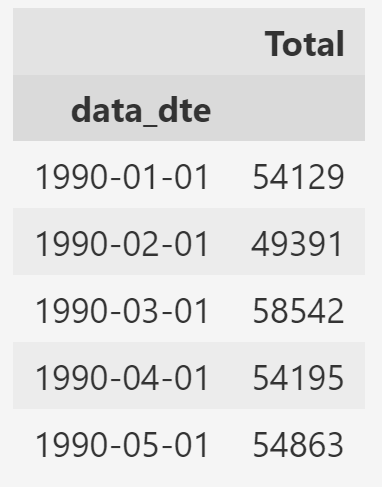  
  
  The next thing to be done is to remove the trend from the data, i.e., make it stationary. To achieve this, the first difference is taken, which means basically taking in each data point and subtracting the data point for the month that comes prior.  
  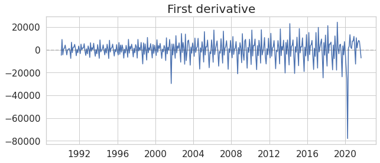  
  Now the data is almost centered around 0 so there is no upwards or downwards trend but it still has the seasonality ofcourse. By this, the integrated order (`d`) is found to be 1.  

  The next thing to be done is to determine the ACF and PACF values fot the first differenced data to get an idea of what order should the model use for the seasonal AR and seasonal MA parts.  

  The ACF looks like this :  
  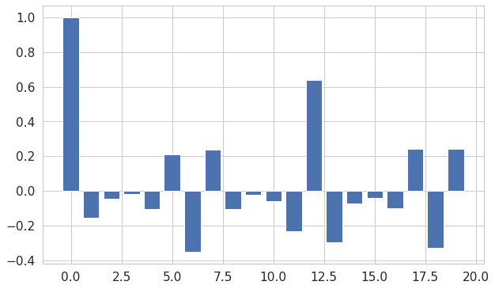  
  There is no significant lags until it gets close to 12. It can be said that there is 12 months lag within the data or another way to say that is 1 year lag we get some noticable behaviour in the ACF.  
  Therefore, based on the ACF, the model should start with a seasonal MA process with a lag of 1 year.  

  The PACF looks like this :  
  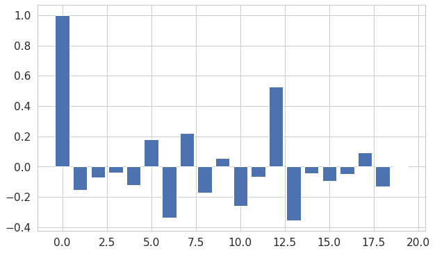  
  Again there is no significant lags until it gets close to 12.  
  Therefore, based on the PACF, the model should start with a seasonal AR process with a lag of 1 year.
  
## Transforming the data for tree based models

  With tree based models, it gets easier to predict with multiple variables (features). So for these kind of models, multivariate transformation is done.
  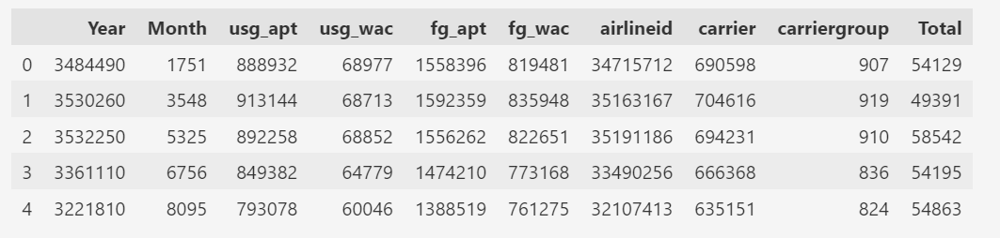  
  The `Year` and `Month` variables might be removed.

## Transforming the data for Neural Network (Tensorflow LSTM)

  A deep learning neural network like LSTM is proved to be very efficient when it comes to forecasting.  It takes an array of the variable which is to be predicted, in its scaled form.  
  It looks something like this :  
  `array([[0.21163885],  
      [0.1780303 ],  
      [0.24294208],  
      [0.21210702],  
      [0.21684544]], dtype=float32)`

# Models which will be used for Forecasting

## Holt-Winter's Method

The Holt-Winters method — also known as triple exponential smoothing — is an incredibly powerful and straightforward method for time series forecasting. This method is also capable of handling both trend and seasonality.  

### Components of Holt-Winter's Method

The Holt-Winters method is referred to as triple exponential smoothing because this method is a combination of these three elements :  

1. Simple Exponential Smoothing (SES)
2. Holt’s Exponential Smoothing (HES)
3. Winter’s Exponential Smoothing (WES)

### Simple Exponential Smoothing

Simple exponential smoothing makes the level of the time series an unchanging assumption. Therefore, it cannot be used to series that have seasonality, trend, or both.  
It is based on this equation :
$$
L_t=\alpha y_t+(1-\alpha) L_{t-1}
$$
Where:
$y_t$ is the value at current time step $t, L_t$ is the level estimate for $t, L_{t-1}$ is the previous level estimate, and $\alpha$ is a smoothing constant.  
This equation, which updates the level of the current time step depending on the prior level estimate, is known as the level update equation.  
The smoothing constant is represented by the $\alpha$ symbol,. The smoothing constant, whose domain is 0 to 1, determines how much of the current level estimate is based on previous values. This is because the level update equation is recursive.

### Holt’s Exponential Smoothing

Because it permits the time series data to have a trend component, Holt's exponential smoothing is an improvement above simple exponential smoothing. Seasonal data are still insurmountable for Holt's exponential smoothing.  
A forecast with Holt’s method can be defined as:  
Level update equation :
$$
F_{t+k}=L_t+k T_t
$$
Where:
$L_t$ is the level estimate for time $t, k$ is the number of forecasts into the future, and $T_t$ is the trend at time $t$.
Trend update equation :
$$
T_t=\beta\left(L_t-L_{t-1}\right)+(1-\beta) T_{t-1}
$$
Where:
$L_t$ is the level estimate for time $t$ and $T_t$ is the trend at time $t$.
The alpha smoothing constant from earlier in SES is more or less comparable to the beta smoothing constant, which is the trend equation's own smoothing constant. Beta also has the domain 0 ≤ β ≤ 1, and it dictates how how fast a given trend estimate should be adjusted.

### Winter’s Exponential Smoothing

A development of Holt's exponential smoothing, Winter's exponential smoothing now permits the introduction of seasonality. The Holt-Winters method is known as Winter's exponential smoothing.  
A forecast with Winter’s exponential smoothing can be expressed as:
$$
F_{t+k}=L_t+k T_t+S_{t+k-M}
$$
Where:
$L_t$ is the level estimate for time $t, k$ is the number of forecasts into the future, $T_t$ is the trend estimate at time $t, S_t$ is the seasonal estimate at time $t$, and $M$ is the number of seasons.

## SARIMA

